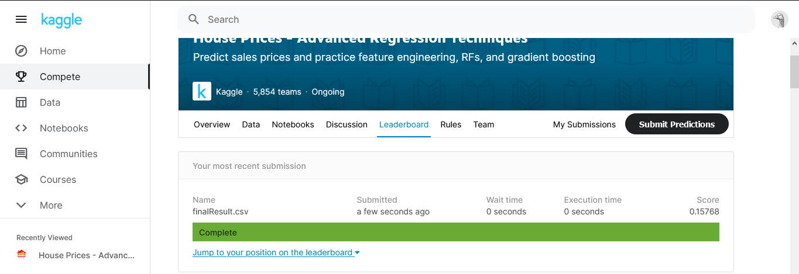

# HousePricePrediction
This is an ML project for predictig house prices prediction.

This is done for `Kaggle` competetion that I got a very good result that my score was 0.15 that you can see it below.
The result file also is in files.

Also here is the link.

There is notebook that codes and also some description is there. Besides the code, description is also my reasearch
that I used different resources such as `Kaggle` and `Medium`.

### What I have done?

The code has four phases:
* Phase0 is reading data and analyzing them.
* Phase1 is preprocessing data
* Phase2 is predicting and regression using different algorithms: `Decision Tree`, `KNN`, and `Linear Regression`
* Phase3 is using voting algorithms such as `Random Forest`

### Files

There is `.ipynb` file that is the notebook and also there is `HTML` format of notebook.

There is `data_description.txt` which is description of columns in `train_data.csv`.

`train.csv` consists of train data.

`sample_submission.csv` is for `kaggle`.

`test.csv` has data for `kaggle` tests.

*Made By Amirhossein Abaskohi*
